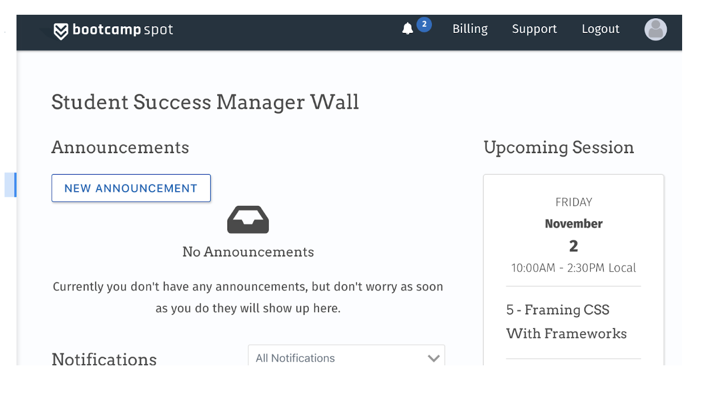

## Student Support
[Back to Course Guidelines](../../README.md#course-guidelines)

1. [Class Videos](#class-videos)
2. [Tutoring](#tutoring-details)
3. [Office Hours](#office-hours)     
4. [Important Links And Notes](#important-links-and-notes)
5. [Course Content Overview](#course-content-overview) 
6. [Technical Curriculum by Week](#technical-curriculum-by-week)   

#### Class Videos
[Back to top](#student-support)

Supplemental videos:

#### Unit 1 Videos

* [Complete Playlist (Exercises)](https://www.youtube.com/playlist?list=PLgJ8UgkiorClK-ZG5jYqbdgOD2DRHROkT)

* [Homework Solution Video](https://youtu.be/qMbCiVYQLCU)

- - -

### Unit 2: CSS and Bootstrap

* [Responsiveness Assignment (3 Versions of Portfolio)](../01-Class-Content/02-css-bootstrap/02-Homework/Instructions/homework-instructions.md)

#### Unit 2 Videos

* [Complete Playlist (Exercises)](https://www.youtube.com/playlist?list=PLgJ8UgkiorCkLBEm5V0IzuhjdWBeKvrOC)

* [Homework Solution Video #1](https://youtu.be/jF0kIhpX6tk)

- - -

### Unit 3: Intro to JavaScript

* [Psychic Game (Basic)](../01-Class-Content/03-javascript/02-Homework/Instructions/homework-instructions.md#option-one-psychic-game-basic)
* [Word Guess Game (Challenge - Recommended)](../01-Class-Content/03-javascript/02-Homework/Instructions/homework-instructions.md#option-two-word-guess-game-challenge---recommended)

#### Unit 3 Videos

* [Complete Playlist (Exercises)](https://www.youtube.com/playlist?list=PLgJ8UgkiorCmEChEWfh7sxPvQwYAx3Kt0)

* [Homework Solution Video](https://youtu.be/cgdmOR15cn4)

- - -

### Unit 4: Intro to jQuery

* [CrystalsCollector Game (Recommended)](../01-Class-Content/04-jquery/02-Homework/Instructions/homework_instructions.md#option-one-crystalscollector-game-recommended)
* [RPG Game (Challenge)](../01-Class-Content/04-jquery/02-Homework/Instructions/homework_instructions.md#option-two-star-wars-rpg-game-challenge)

#### Unit 4 Videos

* [Complete Playlist (Exercises)](https://www.youtube.com/playlist?list=PLgJ8UgkiorCn05TQ1Ui8_lTnhizYcEFX7)

* [Homework Solution Video](https://youtu.be/ki36iUBbCDY)

- - -

### Unit 5: JS Timers, Review, and Trivia

* [Trivia Game Basic Quiz (Timed Form)](../01-Class-Content/05-timers/02-Homework/Instructions/homework-instructions.md#option-one-basic-quiz-timed-form)
* [Trivia Game Advanced Assignment (Timed Questions)](../01-Class-Content/05-timers/02-Homework/Instructions/homework-instructions.md#option-two-advanced-assignment-timed-questions)

#### Unit 5 Videos

* [Complete Playlist (Exercises)](https://www.youtube.com/playlist?list=PLgJ8UgkiorCncwPdhG7Z7A2HOAKcnmIQr)

* [Homework Solution Video (Easy)](https://www.youtube.com/watch?v=3eWhkc_u5rE&index=6&list=PLgJ8UgkiorClJwRrLq8f9QuzgTflJoeH2)

* [Homework Solution Video (Advanced)](https://youtu.be/KndV7UxLpnk)

- - -

### Unit 6: Intro to APIs and AJAX

* [GifTastic](../01-Class-Content/06-ajax/02-Homework/Instructions/homework.md)

#### Unit 6 Videos  

* [Complete Playlist (Exercises)](https://www.youtube.com/playlist?list=PLgJ8UgkiorCmRwLl7YKfFxmNySuAhNdmC)

* [Complete NYT Solution Video](https://www.youtube.com/watch?v=PDD8NV3sbZo)

* [Homework Solution Video](https://www.youtube.com/watch?v=V67yKAonLa4&list=PLgJ8UgkiorClJwRrLq8f9QuzgTflJoeH2&index=8)

- - -

### Unit 7: Intro to Local Storage and Firebase

* [Train Scheduler (Basic - Recommended)](../01-Class-Content/07-firebase/02-Homework/Instructions/Homework_Train_Activity_Basic.md)
* [Rock Paper Scissors (Challenge)](../01-Class-Content/07-firebase/02-Homework/Instructions/Homework_RPS_Activity_Challenge.md)

#### Unit 7 Videos

* [Complete Playlist (Exercises)](https://www.youtube.com/playlist?list=PLgJ8UgkiorCkg74BLGZkgtJsRDQX51YbU)

* [Homework Solution Video](https://www.youtube.com/watch?v=Dz5iKzwHi0k&index=9)

- - -

### Unit 10: Intro to Node.JS

* [LIRI Bot](../01-Class-Content/10-nodejs/02-Homework/Instructions/homework_instructions.md)

#### Unit 10 Videos
* [Complete Playlist (Exercises)](https://www.youtube.com/playlist?list=PLgJ8UgkiorCnevQjLViL_kxpU30eIJFu7)

* [Homework Solution Video](https://www.youtube.com/watch?v=1-k08YfQbec&list=PLgJ8UgkiorClJwRrLq8f9QuzgTflJoeH2&index=9)

- - -

### Unit 11: Constructors

* [Constructor Word Guess (Optional)](../01-Class-Content/11-js-constructors/02-Homework/Instructions/HomeworkInstructions.md)

#### Unit 11 Videos

* [Complete Playlist (Exercises)](https://www.youtube.com/playlist?list=PLgJ8UgkiorClIZdJL_PasNdUR0yWjBCBP)

- - -

### Unit 12: MySQL

* [Bamazon Storefront](../01-Class-Content/12-mysql/02-Homework/Instructions/homework_instructions.md)

#### Tutoring
[Back to top](#student-support)

Tutoring Sessions will be made available to you if needed.

These sessions require that you have turned in homework and are in good standing with your attendance.

**How the system works:**

1) If you are interested in tutoring, you can find a chat window within BootcampSpot to request a tutor. You must also meet the attendance and homework requirements 

2) Once you have communicated your desire for a tutor through BootcampSpot the Student will receive an email with their assigned tutor 24-48 hours.Student will need to schedule their first session 24-48 hours after receiving email. 

Steps: 

**Step ONE** Log into BCS, on the main page click the support button on the nav bar.

 

**Step TWO** From the drop down choose “I am a student” and “Tutor Request”. In the text box include topics you’d like support with along with your Github username. 

  

**Step THREE** You will receive an email from Central Supports within 24-48 hours connecting you to your assigned tutor!

#### Tutoring Details
[Back to top](#student-support)

**Keep in mind any time zone differences. Please make sure to discuss it with your tutor.  This issue has created a few missed sessions in the past.**

**Sessions should be 45 minutes in length. Once a week via a video using google hangouts.**

4) At the end of each session discuss scheduling the next session.  

5) Both the tutor and the student are **required** to fill out an evaluation form after EACH session.  Data is very important to the ongoing success of Central Support.  **Every tutor assignment email has the link to the Student’s Evaluation Form.**

* **If a student No-Shows to a session, the student may not be eligible for tutoring in the future.**

* **If student needs to change the appointment communicate with your tutor immediately.**

####  Office Hours
[Back to top](#student-support)

Live Office Hours:

Every Class Day 45 minutes before class and 30 minutes after class to review course material

Reserve one 15 minute session with TAs / day.
1:1 office hours are intended to get you un-stuck and back on track.
1:1 office hours are intended to review concepts in scope and sequence to the class material.

## Important Links And Notes
[Back to top](#student-support)

Slack
> Used for communication, collaboration, and exploration

[BootcampSpot / Homework](https://bootcampspot.com/)
> Used for class attendance (CHECK-IN), Homework & Project Submissions, Course Outline

[Pre-Work](https://coding-bootcamp-fsf-prework.readthedocs-hosted.com/en/latest/)

> Please [click here](https://coding-bootcamp-fsf-prework.readthedocs-hosted.com/en/latest/) to access the pre-work.

>**Due on the first day of class**

## Course Content Overview
[Back to top](#student-support)

The **`Course Content`** listing will lead you to specific sections of the course. Each secion will contain:

*  an `activites Directory`

> These are activities for classtime lab.

* `Student Resources`

> This is a listing of Students Resources: links, terminology, install instructions, etc.

*  `Homework Descriptions`

> This is a listing for Homework description with Detailed Instructions.

*  `Code Drills`

> Additional Coding Drills to be done outside of class. These drills intend to reinforce, build on, expland, or review core classroom content.

These directories will be released week by week, day by day, as we progress through the course and will provide you with an optimal `scope` and `sequence` on your path developing your skill working with `Data`.

## Technical Curriculum by Week
[Back to top](#student-support)

Please see [bootcampspot.com](https://bootcampspot.com/)

##### The material covered in this syllabus is subject to change. Our academic team adjusts to the market rapidly.
